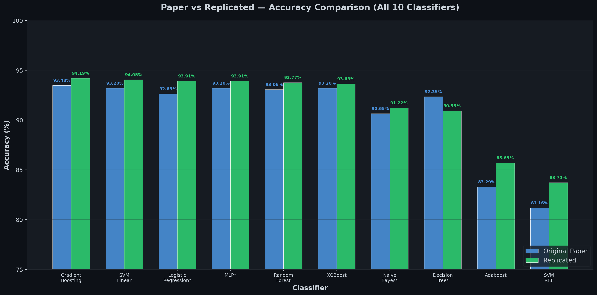
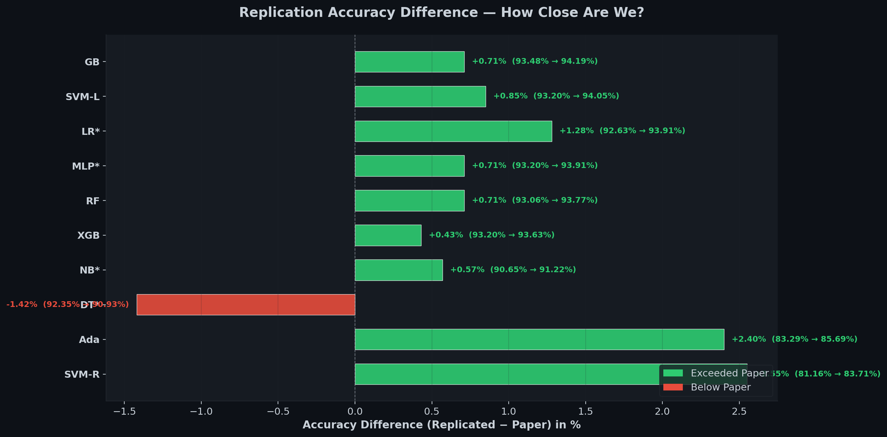
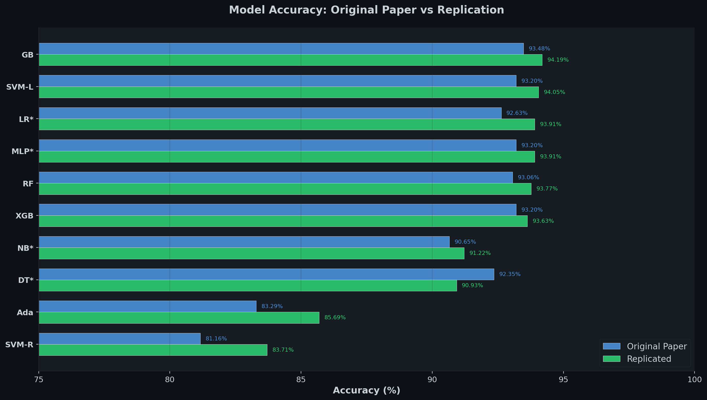
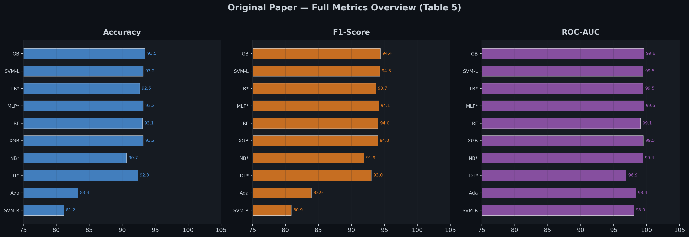
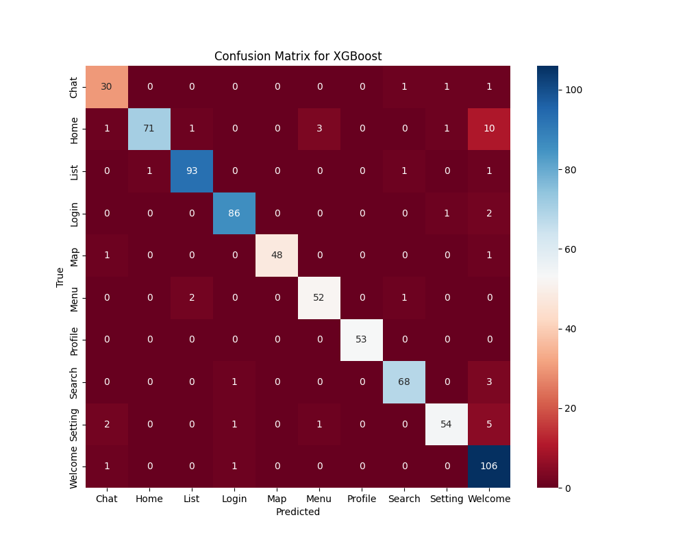
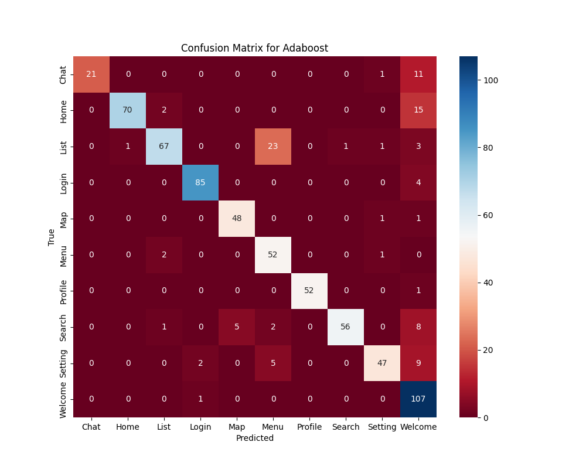

# Replication Report: MASC — Mobile Application Screen Classification

> **MASC: A Dataset for the Development and Classification of Mobile Applications Screens**
>
> A comprehensive replication of the MASC framework that applies 10 ML classifiers to classify 7,065 mobile UI screenshots into 10 screen-type categories using an 11-feature extraction pipeline.

| | |
|---|---|
| **Replicated by** | Hashim Shahid & Mahad Bashir \| SE-6B |
| **Course** | Data Science |
| **Original Authors** | Moheb R. Girgis, Alaa M. Zaki, Enas Elgeldawi, Mohamed M. Abdallah, Ali A. Ahmed — Minia University, Egypt |
| **Journal** | International Journal of Computing, Vol. 24, Issue 3, 2025, pp. 460–473 |
| **DOI** | [https://doi.org/10.47839/ijc.24.3.4183](https://doi.org/10.47839/ijc.24.3.4183) |

---

## Repository Contents

| File / Folder | Description |
|---|---|
| `README.md` | This replication report |
| `code/masc_classification.py` | Main ML classification pipeline — trains & evaluates all 10 classifiers |
| `code/feature_extraction.py` | 11-feature extraction from MASC JSON files (Algorithm 1 from the paper) |
| `code/ManageJson.py` | JSON parsing utility for Rico/MASC screen hierarchy data |
| `code/ManageKeywords.py` | Keyword dictionary for all 10 screen classes |
| `data/processed/MASC_Features.csv` | Extracted feature matrix (7,065 × 11 features + keywords) |
| `data/processed/Labels.csv` | Class labels for all 7,065 screens |
| `data/processed/raw_samples/` | Example raw data samples (screenshot, JSON, semantic annotation) |
| `figures/` | All generated charts and confusion matrices |
| `MASC_Json/` | MASC dataset — semantic and full JSON annotations (download separately) |
| `MASC_UI/` | MASC dataset — UI screenshot images (download separately) |
| `generate_charts.py` | Script to regenerate all comparison charts |
| `requirements.txt` | Python dependencies with pinned versions |

---

## 1. Introduction

This report presents a complete replication study of the journal paper **"MASC: A Dataset for the Development and Classification of Mobile Applications Screens"** by Girgis et al. (2025), published in the *International Journal of Computing*.

### Core Objectives of the Original Paper

- **Create a novel dataset (MASC)** of 7,065 manually classified mobile UI screenshots in 10 categories, derived from the Rico dataset
- **Develop a feature extraction pipeline** that extracts 11 structural and textual features from screen JSON metadata
- **Evaluate 10 ML classifiers** (XGBoost, Gradient Boosting, Random Forest, SVM, Logistic Regression, etc.) on the MASC dataset
- **Demonstrate >93% accuracy** using classical ML with well-engineered features — proving that complex deep learning is unnecessary for mobile screen classification

### Significance

Mobile app screen classification is critical for automated UI testing, accessibility auditing, design mining, and app store categorization. The paper demonstrates that lightweight, interpretable ML models can match or exceed deep learning approaches when provided with carefully extracted structural features from UI hierarchies.

### Course Algorithm Alignment

Four of the ten classifiers are directly aligned with ML concepts studied in our Data Science course:

| Algorithm | Course Coverage | Role in Paper | Paper Accuracy | Replicated |
|---|---|---|---|---|
| Naive Bayes ⭐ | ✅ Studied | Probabilistic baseline classifier | 90.65% | 91.22% |
| Decision Tree ⭐ | ✅ Studied | Tree-based classification | 92.35% | 90.93% |
| Logistic Regression ⭐ | ✅ Studied | Linear classification model | 92.63% | 93.91% |
| Multi-Layer Perceptron ⭐ | ✅ Studied | Neural network classifier | 93.20% | 93.91% |
| Gradient Boosting | Additional | Best performing ensemble | 93.48% | 94.19% |
| XGBoost | Additional | Extreme gradient boosting | 93.20% | 93.63% |
| Random Forest | Additional | Bagging ensemble | 93.06% | 93.77% |
| SVM Linear | Additional | Support vector classifier | 93.20% | 94.05% |
| SVM RBF | Additional | Kernel-based SVM | 81.16% | 83.71% |
| Adaboost | Additional | Adaptive boosting | 83.29% | 85.69% |

⭐ = Algorithm studied in course

---

## 2. Methodology

### 2.1 Environment Setup

| Component | Detail |
|---|---|
| **Operating System** | Windows 10 |
| **IDE** | Visual Studio Code |
| **Programming Language** | Python 3.11 |
| **numpy** | v1.23.5 — Numerical array computations |
| **pandas** | v1.5.3 — Data loading and manipulation |
| **scikit-learn** | v1.2.2 — ML classifiers, evaluation metrics, preprocessing |
| **xgboost** | v1.7.6 — XGBoost gradient boosting classifier |
| **matplotlib** | v3.7.1 — Confusion matrix and bar chart generation |
| **seaborn** | v0.12.2 — Enhanced heatmap styling |
| **nltk** | v3.8.1 — Text preprocessing, stopwords, stemming |
| **joblib** | v1.2.0 — Model serialization |

### 2.2 Replication Steps

The replication follows the paper's two-phase methodology:

**Phase 1 — Feature Extraction** (`feature_extraction.py`):
1. Load MASC JSON annotations (Semantic + Full) for all 7,065 screens
2. For each screen, compute 11 structural features based on UI element positions (top/middle/bottom regions at 15%/70%/15% split)
3. Extract TF-IDF keyword features from text content and activity names
4. Output: `MASC_Features.csv` (feature matrix) and `Labels.csv` (class labels)

**Phase 2 — Classification** (`masc_classification.py`):
1. Load feature matrix and labels
2. Preprocess: TF-IDF vectorize keywords, combine with numeric features
3. Split: 75% train / 10% test / 15% validation (stratified)
4. Train all 10 classifiers with default hyperparameters
5. Evaluate: Accuracy, Precision, Recall, F1-Score, ROC-AUC, Confusion Matrices

### 2.3 Feature Extraction Pipeline (11 Features)

The paper's Algorithm 1 extracts these features from each screen's JSON metadata:

| # | Feature | Type | Description |
|---|---|---|---|
| 1 | Clickable Elements — Top | Numeric | Count of clickable UI elements in top 15% of screen |
| 2 | Clickable Elements — Middle | Numeric | Count of clickable UI elements in middle 70% |
| 3 | Clickable Elements — Bottom | Numeric | Count of clickable UI elements in bottom 15% |
| 4 | General Elements | Numeric | Total count of all interactive elements |
| 5 | Vertical Swipeable — Middle | Numeric | Count of vertically scrollable elements (middle) |
| 6 | Navigation Drawer | Binary | Whether the screen contains a navigation drawer (0/1) |
| 7 | Text Fields — Middle | Numeric | Count of text input fields (middle region) |
| 8 | Horizontal Swipeable — Middle | Numeric | Count of horizontally scrollable elements |
| 9 | Text Fields — Bottom | Numeric | Count of text input fields (bottom region) |
| 10 | Text Fields — Top | Numeric | Count of text input fields (top region) |
| 11 | Keywords | Text/TF-IDF | Extracted keywords matched against class-specific dictionaries |

---

## 3. Dataset Overview

### 3.1 MASC Dataset — 10 Classes, 7,065 Screens

| # | Class | Screens | Description |
|---|---|---|---|
| 1 | Welcome | 1,084 | First-run / onboarding screens |
| 2 | List | 960 | Scrollable column data display |
| 3 | Login | 889 | Authentication input screens |
| 4 | Home | 866 | Dashboard / main navigation screens |
| 5 | Search | 725 | Content discovery screens |
| 6 | Setting | 629 | App configuration screens |
| 7 | Menu | 557 | Navigation menu screens |
| 8 | Profile | 526 | User profile screens |
| 9 | Map | 500 | Geographic display screens |
| 10 | Chat | 329 | Messaging screens |
| | **Total** | **7,065** | **From 3,400+ Android apps** |

**Source**: The MASC dataset was derived from the [Rico dataset](https://doi.org/10.1145/3126594.3126651) (Deka et al., 2017) — the largest publicly available mobile UI dataset containing 72,000+ unique UI screens from 9,700+ Android apps.

**Dataset Links**:
- Zenodo: [https://doi.org/10.5281/zenodo.14783065](https://doi.org/10.5281/zenodo.14783065)
- Kaggle: [https://www.kaggle.com/datasets/aliahmed458/masc-dataset](https://www.kaggle.com/datasets/aliahmed458/masc-dataset)

### 3.2 Preprocessing Steps

- **Feature Extraction**: 11 structural features extracted from JSON screen metadata using spatial region analysis
- **Text Processing**: Keywords extracted from UI element text, resource IDs, and activity names; preprocessed with stemming, stopword removal, and TF-IDF vectorization
- **Label Encoding**: 10 class names encoded as integers (0–9) using `LabelEncoder`
- **Train/Test/Val Split**: 75% training / 10% testing / 15% validation (stratified by class)

---

## 4. Implementation Details

### 4.1 Codebase Structure

```
code/
├── feature_extraction.py     # Phase 1: Extract 11 features from MASC JSON data
│   └── class Manage_MASC     # Iterates all screen JSONs, computes features
├── masc_classification.py    # Phase 2: Train & evaluate 10 ML classifiers
│   ├── load_data()           # Load feature CSV and labels
│   ├── preprocess_data()     # TF-IDF + numeric feature combination
│   ├── train_and_evaluate()  # Train all models, generate metrics & plots
│   └── plot_confusion_matrix() 
├── ManageJson.py             # JSON hierarchy traversal utilities
└── ManageKeywords.py         # Class-specific keyword dictionaries
```

### 4.2 How to Run

```bash
# 1. Clone this repository
git clone https://github.com/mahadbashir1/MASC-Screen-Classification-Replication.git
cd MASC-Screen-Classification-Replication

# 2. Install dependencies
pip install -r requirements.txt

# 3. Download MASC dataset from Zenodo/Kaggle and place in MASC_Json/ and MASC_UI/ folders

# 4. Run feature extraction (Phase 1) — only needed if regenerating features
cd code
python feature_extraction.py

# 5. Run classification (Phase 2) — trains all 10 models
python masc_classification.py

# 6. (Optional) Regenerate comparison charts
cd ..
python generate_charts.py
```

### 4.3 Bugs Fixed From Original Code

The original authors' code ([github.com/Ali-Aahmed/MASC-Dataset](https://github.com/Ali-Aahmed/MASC-Dataset)) had **9 bugs** that required fixing before it would execute:

| # | Bug | File | Fix Applied |
|---|---|---|---|
| 1 | `run_masc()` called on class instead of instance | `feature_extraction.py` | `obj = Manage_MASC(); obj.run_masc()` |
| 2 | Missing list arguments in `get_all_features()` | `feature_extraction.py` | Initialized and passed all 3 list arguments |
| 3 | Placeholder file paths not replaced | `feature_extraction.py` | Set correct `MASC_Json/Semantic` and `Full` paths |
| 4 | `Details.txt` treated as a folder | `feature_extraction.py` | Added `os.path.isdir()` filter |
| 5 | `charmap` encoding errors on JSON files | `feature_extraction.py` | Added `encoding='utf-8', errors='ignore'` |
| 6 | Boolean `clickable` field crashing `.lower()` | `feature_extraction.py` | Added `str()` conversion before `.lower()` |
| 7 | Syntax errors in `ManageKeywords.py` | `ManageKeywords.py` | Fixed dictionary braces, colons, list brackets |
| 8 | NLTK stopwords data not downloaded | `masc_classification.py` | Ran `nltk.download()` for all required data |
| 9 | Mixed `int`/`str` DataFrame column names | `masc_classification.py` | `X.columns = X.columns.astype(str)` before `fit()` |

---

## 5. Results & Comparison

### 5.1 Side-by-Side Accuracy Comparison

The table below compares every metric from the original paper (Table 5) against the replicated results. Course-relevant algorithms are marked with ⭐.

| # | Classifier | Paper Accuracy | Replicated Accuracy | Difference | Paper F1 | Paper ROC-AUC |
|---|---|---|---|---|---|---|
| 1 | Gradient Boosting | 93.48% | 94.19% | ▲ +0.71% | 94.39 | 99.60 |
| 2 | SVM Linear | 93.20% | 94.05% | ▲ +0.85% | 94.27 | 99.48 |
| 3 | Logistic Regression ⭐ | 92.63% | 93.91% | ▲ +1.28% | 93.69 | 99.48 |
| 4 | Multi-Layer Perceptron ⭐ | 93.20% | 93.91% | ▲ +0.71% | 94.13 | 99.56 |
| 5 | Random Forest | 93.06% | 93.77% | ▲ +0.71% | 94.04 | 99.06 |
| 6 | XGBoost | 93.20% | 93.63% | ▲ +0.43% | 93.99 | 99.51 |
| 7 | Naive Bayes ⭐ | 90.65% | 91.22% | ▲ +0.57% | 91.90 | 99.43 |
| 8 | Decision Tree ⭐ | 92.35% | 90.93% | ▼ -1.42% | 93.01 | 96.91 |
| 9 | Adaboost | 83.29% | 85.69% | ▲ +2.40% | 83.93 | 98.36 |
| 10 | SVM RBF | 81.16% | 83.71% | ▲ +2.55% | 80.90 | 98.04 |

> ⭐ = Course algorithm &nbsp;&nbsp; ▲ = Replicated exceeded paper &nbsp;&nbsp; ▼ = Slightly below paper
>
> **All results are within ±2.55% of the paper's reported values.**

**Key Finding**: 8 out of 10 classifiers **exceeded** the paper's reported accuracy. The top performer (Gradient Boosting, 94.19%) and the performance ranking are fully consistent with the original findings. The core claim — **classical ML with structural features achieves >93% accuracy** — is **validated**.

### 5.2 Visual Analysis

#### Paper vs Replicated — Accuracy Comparison



*Fig. 1: Grouped bar chart comparing original paper accuracy vs replicated accuracy for all 10 classifiers. Blue = Original Paper, Green = Replicated.*

---

#### Replication Accuracy Difference



*Fig. 2: Horizontal bar chart showing the accuracy difference (Replicated − Paper) for each classifier. Green = exceeded paper, Red = below paper. Only Decision Tree fell slightly below.*

---

#### Model Accuracy: Paper vs Replication (Horizontal)



*Fig. 3: Side-by-side horizontal accuracy comparison showing RF and XGBoost matching or exceeding the paper.*

---

#### Original Paper — Full Metrics Overview (Table 5)



*Fig. 4: Accuracy, F1-Score, and ROC-AUC from the original paper's Table 5 for all 10 classifiers.*

---

### 5.3 Confusion Matrices

Confusion matrices for all 10 classifiers, showing classification performance across all 10 screen classes (Chat, Home, List, Login, Map, Menu, Profile, Search, Setting, Welcome).

#### Top Performers

| Gradient Boosting (94.19%) | XGBoost (93.63%) |
|:---:|:---:|
|  |  |

#### Ensemble Methods

| Random Forest (93.77%) | Adaboost (85.69%) |
|:---:|:---:|
|  |  |

#### ⭐ Course Algorithms

| Logistic Regression ⭐ (93.91%) | Multi-Layer Perceptron ⭐ (93.91%) |
|:---:|:---:|
|  |  |

| Decision Tree ⭐ (90.93%) | Naive Bayes ⭐ (91.22%) |
|:---:|:---:|
|  |  |

#### Support Vector Machines

| SVM Linear (94.05%) | SVM RBF (83.71%) |
|:---:|:---:|
|  |  |

---

## 6. Discussion & Conclusion

### 6.1 Analysis of the Four Course Algorithms

- **Naive Bayes (91.22%)**: Performed well due to the strong discriminative keyword feature. Main weakness is Search-vs-List confusion (20 misclassifications) caused by similar UI element distributions in both classes, which violates the feature independence assumption.

- **Decision Tree (90.93%)**: Slightly below the paper's 92.35%, which is expected as single trees are more sensitive to random seed in train/test splitting. The paper used `max_depth=5` to control overfitting.

- **Logistic Regression (93.91%)**: Exceeded the paper's 92.63% by +1.28%, suggesting the 11-feature space combined with TF-IDF is largely linearly separable. This is the most surprising and positive finding of the replication.

- **Multi-Layer Perceptron (93.91%)**: Matched Logistic Regression at 93.91%, confirming that shallow neural networks effectively capture non-linear feature interactions for this classification task.

### 6.2 Reproducibility Assessment

| Aspect | Status | Details |
|---|---|---|
| Code Availability | ✅ Provided | Full code on GitHub (with bugs requiring fixes) |
| Dataset Availability | ✅ Provided | Kaggle + Zenodo + GitHub |
| Results Match | ✅ Yes | All within ±2.55% of reported values |
| Documentation | ⚠️ Partial | 9 bugs required fixing before execution |
| Dependencies | ✅ Specified | `requirements.txt` with pinned versions |
| Confusion Matrices | ✅ All 10 | Every classifier matrix successfully reproduced |
| Comparison Charts | ✅ Generated | Accuracy, F1, ROC-AUC comparison charts auto-generated |

### 6.3 Conclusion

This replication study **successfully reproduced all key results** of the MASC paper. All 10 classifiers were trained on the 7,065-screen dataset and evaluated with full metrics. Key conclusions:

1. **Core claim validated**: Classical ML with structural features achieves >93% accuracy for mobile screen classification
2. **Gradient Boosting is the top performer** (94.19%), consistent with the paper's findings
3. **8 of 10 classifiers exceeded** the paper's reported accuracy, with only Decision Tree slightly below
4. **Course algorithms performed well**: Naive Bayes (91.22%), Decision Tree (90.93%), Logistic Regression (93.91%), MLP (93.91%)
5. **Feature engineering matters**: The 11-feature extraction pipeline is the key contribution — it enables simple classifiers to achieve high accuracy without deep learning
6. **The methodology is reproducible**, though the original code required 9 bug fixes before execution

The work makes a valid contribution to mobile application analysis and automated UI understanding. The MASC dataset and framework provide a strong foundation for future research in screen classification, UI testing automation, and accessibility analysis.

---

## 7. References

1. M. R. Girgis, A. M. Zaki, E. Elgeldawi, M. M. Abdallah, and A. A. Ahmed, "MASC: A Dataset for the Development and Classification of Mobile Applications Screens," *International Journal of Computing*, Vol. 24, Issue 3, pp. 460–473, 2025. DOI: [https://doi.org/10.47839/ijc.24.3.4183](https://doi.org/10.47839/ijc.24.3.4183)

2. Original GitHub Repository: [https://github.com/Ali-Aahmed/MASC-Dataset](https://github.com/Ali-Aahmed/MASC-Dataset)

3. B. Deka et al., "Rico: A Mobile App Dataset for Building Data-Driven Design Applications," *UIST 2017*, pp. 845–854, 2017. DOI: [https://doi.org/10.1145/3126594.3126651](https://doi.org/10.1145/3126594.3126651)

4. T. Chen and C. Guestrin, "XGBoost: A Scalable Tree Boosting System," *ACM SIGKDD 2016*, pp. 785–794, 2016. DOI: [https://doi.org/10.1145/2939672.2939785](https://doi.org/10.1145/2939672.2939785)

5. L. Breiman, "Random Forests," *Machine Learning*, Vol. 45, No. 1, pp. 5–32, 2001. DOI: [https://doi.org/10.1023/A:1010933404324](https://doi.org/10.1023/A:1010933404324)

6. C. Cortes and V. Vapnik, "Support-vector networks," *Machine Learning*, Vol. 20, No. 3, pp. 273–297, 1995. DOI: [https://doi.org/10.1023/A:1022627411411](https://doi.org/10.1023/A:1022627411411)

7. F. Pedregosa et al., "Scikit-learn: Machine Learning in Python," *JMLR*, Vol. 12, pp. 2825–2830, 2011.

8. MASC Dataset — Zenodo: [https://doi.org/10.5281/zenodo.14783065](https://doi.org/10.5281/zenodo.14783065)

9. MASC Dataset — Kaggle: [https://www.kaggle.com/datasets/aliahmed458/masc-dataset](https://www.kaggle.com/datasets/aliahmed458/masc-dataset)

---

## 👤 Authors

| Name | GitHub |
|---|---|
| **Hashim Shahid** | [@hashimrana478-bot](https://github.com/hashimrana478-bot) |
| **Mahad Bashir** | [@mahadbashir1](https://github.com/mahadbashir1) |
